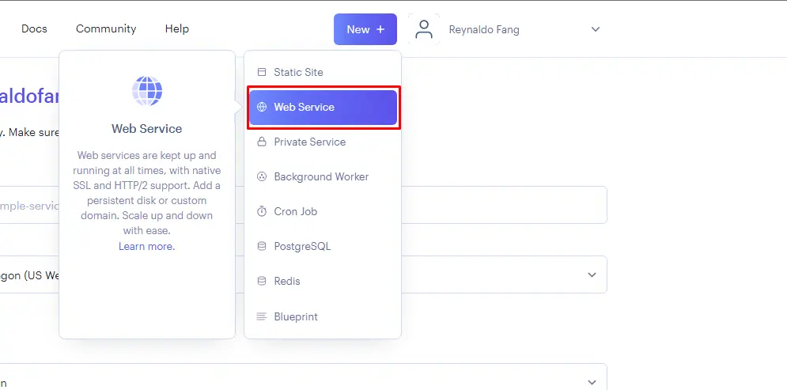
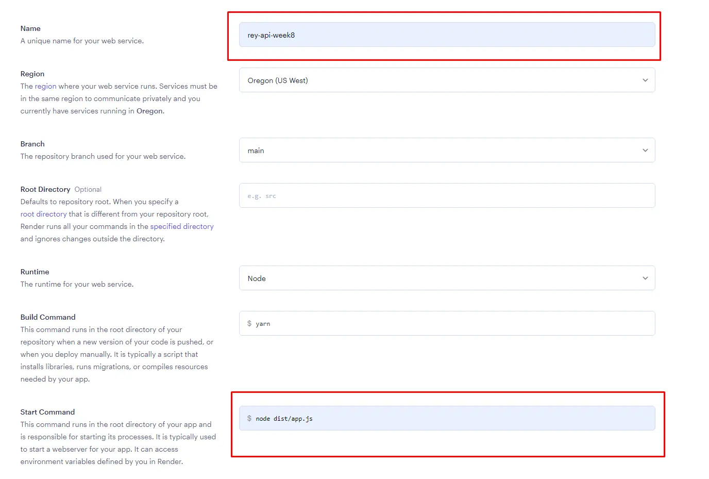
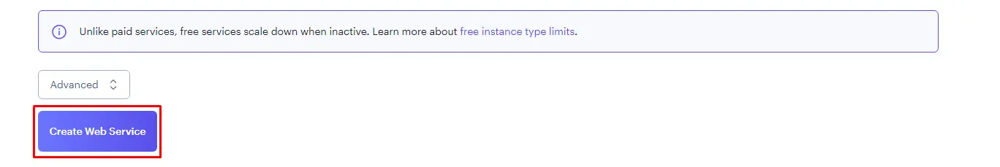
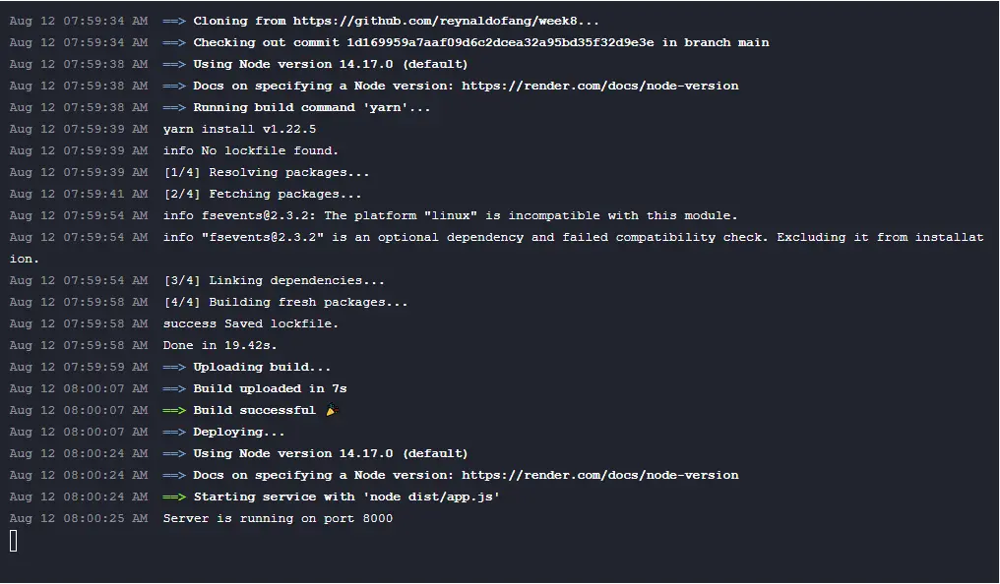

# Week 8 Assignment Rest API - Full-Stack Engineering

This is assigment in week 8 focus about Introduction to Back-end Development - Programming with TypeScript and NodeJS.

- Building a Server App Using Node js, Typescript and Express.
- Build a simple routing with various method.
- Deploying a simple app

If you want to follow me on social media, you can directly click the link below.

[](https://www.linkedin.com/in/reynaldo-fang/)
[](https://www.instagram.com/reynaldo.fang/)
[](mailto:reynaldofang02@gmail.com)

### Deploy Link

You can check my website here

[Financial Tracker with API - By Reynaldo](https://week-8-reynaldofang.netlify.app/)

### About my Project - How to Build API

### Installation Reminder

1. Before running the application, make sure to install the required packages:

```bash
npm install
```

All Package arleady in `package.json`

```
 "dependencies": {
    "body-parser": "^1.20.2",
    "cors": "^2.8.5",
    "dotenv": "^16.3.1",
    "express": "^4.18.2",
    "ts-node": "^10.9.1"
  },
  "devDependencies": {
    "@types/cors": "^2.8.13",
    "@types/express": "^4.17.17",
    "@types/node": "^20.4.9",
    "concurrently": "^8.2.0",
    "nodemon": "^3.0.1",
    "ts-node": "^10.9.1",
    "typescript": "^5.1.6"
  }
```

2. First build Express.js Server Template

```
import express from "express";
import bodyParser from "body-parser";
import transactionsRouter from "./transaction";
import dotenv from "dotenv";
import cors from "cors";

dotenv.config();

const app = express();
const port = 8000;

app.use(bodyParser.json());

app.use(cors());

app.use("/api", transactionsRouter);

app.listen(port, () => {
  console.log(`Server is running on port ${port}`);
});

```

- **Imports**: Essential packages like `express`, `body-parser`, `dotenv`, and `cors` are imported.

- **Configuration**: Environment variables are loaded from the `.env` file using `dotenv`.

- **Express App**: An instance of the Express app is created with `express()`.

- **Port Definition**: The server listens on port `8000`.

- **Middlewares**:

  - `bodyParser.json()`: Parses incoming JSON payloads.
  - `cors()`: Enables Cross-Origin Resource Sharing (CORS).

- **Routing**: Requests beginning with "/api" are directed to the `transactionsRouter` module.

- **Server Start**: The server is started on the defined port.

- **Transactions Router**: Expected to be imported from `"./transaction"` to define routes for transactions.

3. Make a model for Financial Tracker

```
export interface Transaction {
  id: number;
  amount: number;
  type: string;
  description: string;
}
```

4. Make a router CRUD (Create, Read, Update, Delete)

CRUD operations are essential for interacting with databases and APIs, enabling applications to perform basic data management tasks.

In the context of this project, the following CRUD operations are supported for managing transactions:

- **Create**: Use the `POST` request to add a new transaction.

```
router.post("/transactions", (req, res) => {
  const { amount, type, description } = req.body;

  if (!amount || isNaN(amount)) {
    return res.status(400).json({ error: "Invalid amount" });
  }

  const transcation: Transaction = {
    id: nextId,
    amount,
    type,
    description,
  };

  transactions.push(transcation);

  if (type === "income") {
    balance += amount;
  } else if (type === "expense") {
    balance -= amount;
  }

  nextId++;

  res.json({ message: "Transcation added successfuly", transcation });
});
```

- **Read All**: Utilize the `GET` request to retrieve a list of all transactions along with the current balance.

```
router.get("/transactions", (req, res) => {
  console.log("GET request received at /api/transactions");
  res.json({ transactions, balance });
});
```

- **Read One**: Use the `GET` request with a transaction ID to retrieve details of a specific transaction.

```
router.get("/transactions/:id", (req, res) => {
  const id = parseInt(req.params.id);
  const transaction = transactions.find((trans) => trans.id === id);

  if (!transaction) {
    return res.status(404).json({ error: "Transaction not found" });
  }

  res.json(transaction);
});
```

- **Update**: Update a transaction's details using the `PUT` request, including fields like amount, type, and description.

```
router.put("/transactions/:id", (req, res) => {
  const { id } = req.params;
  const { amount, type, description } = req.body;

  if (!amount || isNaN(amount)) {
    return res.status(400).json({ error: "Invalid amount" });
  }

  const transactionToUpdate = transactions.find(
    (transaction) => transaction.id === parseInt(id)
  );

  if (!transactionToUpdate) {
    return res.status(404).json({ error: "Transaction not found" });
  }

  // Adjust the balance by reversing the previous transaction's effect
  if (transactionToUpdate.type === "income") {
    balance -= transactionToUpdate.amount;
  } else if (transactionToUpdate.type === "expense") {
    balance += transactionToUpdate.amount;
  }

  // Update the transaction with new values
  transactionToUpdate.amount = amount;
  transactionToUpdate.type = type;
  transactionToUpdate.description = description;

  // Adjust the balance with the effect of the updated transaction
  if (type === "income") {
    balance += amount;
  } else if (type === "expense") {
    balance -= amount;
  }

  res.json({
    message: "Transaction updated successfully",
    transaction: transactionToUpdate,
    balance,
  });
});
```

- **Partial Update**: Employ the `PATCH` request to partially update a transaction's details, such as modifying the description.

```
router.patch("/transactions/:id", (req, res) => {
  const id = parseInt(req.params.id);
  const updates = req.body;

  const transactionIndex = transactions.findIndex((trans) => trans.id === id);

  if (transactionIndex === -1) {
    return res.status(404).json({ error: "Transaction not found" });
  }

  transactions[transactionIndex] = {
    ...transactions[transactionIndex],
    ...updates,
  };

  res.json({
    message: "Transaction updated successfully",
    transaction: transactions[transactionIndex],
  });
});
```

- **Delete**: Delete a transaction using the `DELETE` request, which also adjusts the balance accordingly.

```
router.delete("/transactions/:id", (req, res) => {
  const id = parseInt(req.params.id);
  const transactionIndex = transactions.findIndex((trans) => trans.id === id);

  if (transactionIndex === -1) {
    return res.status(404).json({ error: "Transaction not found" });
  }

  const deletedTransaction = transactions[transactionIndex];
  const transactionAmount = deletedTransaction.amount;

  if (deletedTransaction.type === "income") {
    balance -= transactionAmount; // Subtract transactionAmount from balance
  } else if (deletedTransaction.type === "expense") {
    balance += transactionAmount; // Add transactionAmount to balance
  }

  transactions.splice(transactionIndex, 1); // Remove the transaction from the array

  res.json({
    message: "Transaction deleted successfully",
    balance,
  });
});
```

5. If you arleady done all step in top, now deploy the API on Render

#### Deploying the API on Render

Follow these steps to deploy your Express.js API on Render:

1. **Sign Up**: Create an account on the [Render platform](https://render.com/).

2. **Add a Service**:
   - Log in to your Render dashboard.
   - Click "Add a New Service."
   - Choose a name for your service and select the Node.js language.



3. **Configure Your Web Services**:
    - Set up your Name Web Services example: `rey-api-week8`
    - At the start command, don't forget to set it up according to your Express template. example `node dist/app.js`



4. **Deploy**:
   - Render will automatically build and deploy your app.
   - Click "Deploy" to start the process.




5. **Configure Routes**:
   - Set up routes to match your API endpoints.

  ```
  const apiUrl = "https://rey-api-week8.onrender.com";

    fetch(`${apiUrl}/api/transactions`, {
        method: "POST",
        headers: {
          "Content-Type": "application/json",
        },
        body: JSON.stringify(newTransaction),
      })
  ```

Your Express.js API will be live and accessible through the URL provided by Render.

You can check my API in here [Reynaldo API Week 8](https://rey-api-week8.onrender.com/api/transactions)

That all!!

I hope the steps I explained above are clear to you.

Hopefully, you can use the website that I provided.

Thankyou.


